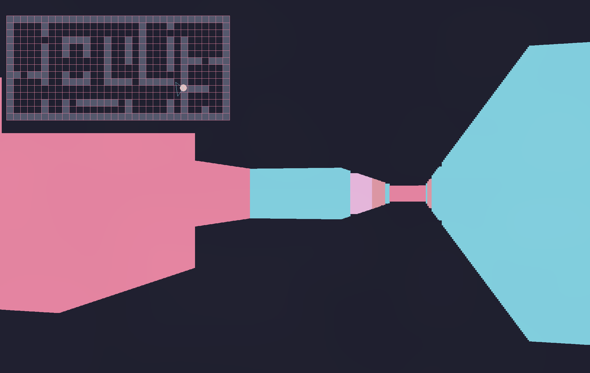

# Humaira - raycasting implementation in pygame



## Controls

| Key | Action        |
| --- | ------------- |
| W   | Move forward  |
| S   | Move backward |
| A   | Turn left     |
| D   | Turn right    |

## Purpose

- The purpose of the project was/is `Recreational programming`.
- The extreme use of `OOP` in this game is not necessary at all. Sorry non-oop dudes!
- Although there are `6` classes in the whole program, the only actually helpful class is the
  `Coordinate` class. All others can be omitted.

## Requirements

- Python 3.10 or later
- Pygame 2.6.1 or later

## Installation

### Arch Linux

```sh
   git clone https://github.com/NerdNinja420/humaira
   cd humaira
   chmod +x ./install.sh
   ./install.sh
   humaira
```

## Resources

- Lode's Raycasting Tutorial: [https://lodev.org/cgtutor/raycasting.html](https://lodev.org/cgtutor/raycasting.html)
- Tsoding's 3D in TypeScript using Ray Casting: [https://www.youtube.com/watch?v=K1xEkA46CuM](https://www.youtube.com/watch?v=K1xEkA46CuM)

## License

This project is licensed under the MIT License.
